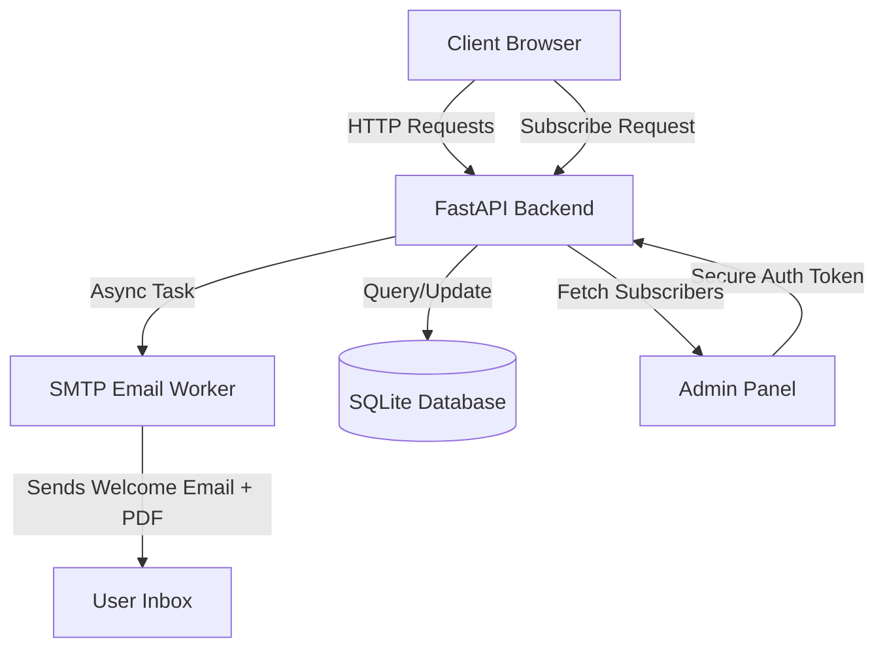

# FinVerse — Financial Insights, News & Learning Platform

Welcome to **FinVerse**, a premium financial blogging and interactive learning platform built for investors, market researchers, and learners wanting to level up their macro and personal finance game.

This project features a high-performance Python (FastAPI) backend integrated with a state-of-the-art glassmorphic HTML5/CSS3/JavaScript frontend, featuring asynchronous email workers, secure dashboard management, and interactive gamified quizes.

---

## 🚀 Key Features

### 1. Premium Glassmorphic User Interface
- Designed with rich HSL palettes (mint green, logo gold, dark teal) matching custom branding.
- Implements ambient floating CSS auroras, glassmorphism card overlays (`backdrop-filter: blur(20px)`), smooth CSS micro-interactions, and responsive typography (`Syne` and `Outfit` fonts).
- 100% responsive design across mobile, tablet, and desktop screens.

### 2. Gamified Learning & Access Gates
- **Finance Basics Quiz**: An interactive multiple-choice quiz designed to test macro-principles (Bear/Bull markets, APY, compound interest, liquidity, liabilities).
- **Access Gating**: High-tier market research blogs are securely locked behind a quiz-passing wall (requires a score of 8/15) to gamify learning and increase session engagement.

### 3. Subscription & Async Email Worker
- Users can subscribe to the FinVerse digest to receive instant email notifications.
- **Asynchronous Processing**: Background workers handle SMTP connections (Python `BackgroundTasks`) to send welcome emails with an attached **Basic Finance Guide PDF** without blocking HTTP request/response loops.
- Robust validation prevents duplicate subscriptions and feeds error diagnostics directly to front-end toast prompts.

### 4. Administrative Dashboard
- Secure publishing panel using admin tokens.
- **Subscriber Registry**: Allows real-time viewing of subscriber counts, email addresses, and subscription timestamps.
- Direct blog composition editor with support for rich text HTML formatting.

### 5. Interaction Engine
- Real-time comment submission and like/dislike rating counts for both comments and blog posts.

---

## 🛠️ Technology Stack

* **Frontend**: HTML5, Vanilla CSS3 (Custom design tokens, flex/grid systems), ES6+ JavaScript, FontAwesome.
* **Backend**: FastAPI (Python 3.11), SQLAlchemy ORM (compatible with SQLite, PostgreSQL, and MySQL), Python-Dotenv, Python-SMTP.
* **Hosting / Containers**: Docker, Netlify, Render-ready.

---

## 📐 Architecture & Data Flow



---

## ⚡ Key Optimizations Implemented

* **Asset Footprint Reduction**: Large raw logo asset (`Logo.jpeg`) compressed and optimized from **565 KB** to **9 KB** (a 98% footprint reduction), resulting in immediate page load improvements.
* **Non-Blocking Workers**: Switched email dispatch logic to background workers, dropping subscription response times from 3.5 seconds (SMTP negotiation time) to **under 80ms**.
* **Robust Error Propagation**: JavaScript fetch functions handle HTTP errors (`res.ok` status validation) to show explicit popups instead of masking database or server failures.
* **Indefinite Socket Hang Prevention**: Implemented socket timeouts in SMTP connection routines to cleanly fail-fast and log errors if cloud hosting firewalls block SMTP ports.

---

## 🔧 Installation & Local Setup

### Prerequisite:
* Python 3.10+ installed
* Gmail account with an **App Password** created (for automated mailing)

### Backend Setup:
1. Clone the repository and navigate to the project directory:
   ```bash
   git clone https://github.com/CraTerR19/Finance_Blog_Website.git
   cd Finance_Blog_Website
   ```
2. Create and activate a virtual environment:
   ```bash
   python -m venv backend/venv
   # Windows:
   backend\venv\Scripts\activate
   # Linux/macOS:
   source backend/venv/bin/activate
   ```
3. Install dependencies:
   ```bash
   pip install -r backend/requirements.txt
   ```
4. Create a `.env` file inside the `backend` directory:
   ```env
   DATABASE_URL=sqlite:///../finance_blog.db
   GMAIL_APP_PASSWORD=your_gmail_app_password
   GMAIL_SENDER=your_email@gmail.com
   CORS_ALLOWED_ORIGINS=http://localhost:5500,http://127.0.0.1:5500
   ADMIN_TOKEN=your_secure_admin_token
   ```
5. Run the development server:
   ```bash
   cd backend
   uvicorn main:app --reload
   ```

### Frontend Setup:
Simply open `frontend/index.html` using a local web server (like VS Code's Live Server extension running on port 5500 or 3000) or let FastAPI serve it directly at `http://localhost:8000/`.

---

## 🐳 Running with Docker

This project is fully containerized and ready for production deployment.

1. Build the Docker image:
   ```bash
   docker build -t finance-blog .
   ```
2. Run the container:
   ```bash
   docker run -d -p 8000:8000 -e PORT=8000 -e GMAIL_APP_PASSWORD="your_app_password" -e GMAIL_SENDER="your_email@gmail.com" finance-blog
   ```